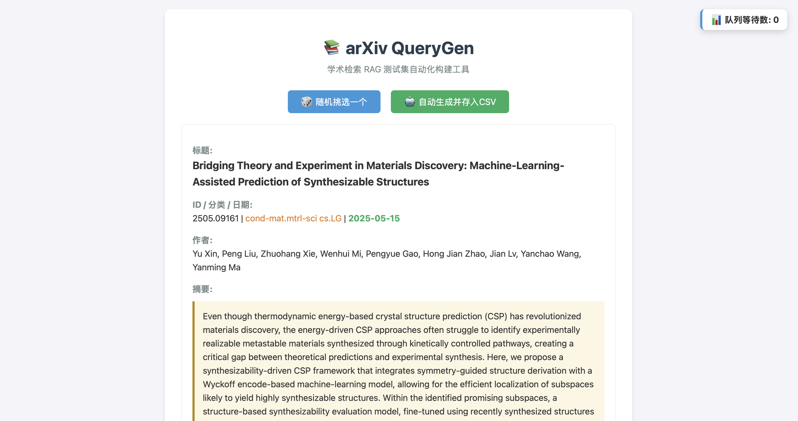

# arXiv QueryGen



一个基于 Flask 的本地网页小工具，用来辅助为学术检索系统（尤其是 Agentic RAG）生成查询评测数据。

平时看 arXiv 论文时，你可能需要积累一些 Benchmark 数据来测 RAG 系统。这玩意儿可以随机抽取你本地准备好的 arXiv Parquet 里的论文，让你通过点按钮的方式，**自动请求大模型为这篇论文生成几组用户视角的自然语言 Query**，然后直接存入 `research_queries.csv`。

核心就是解决“手动想 Query -> 跑大模型 -> 复制粘贴进 CSV”这个繁琐的流程，并且加了异步生成队列，可以直接“点击生成 -> 下一篇”，不用硬干等着。

## 必备要求

### 1. Parquet 数据格式
脚本默认读取根目录或指定路径下的 `arxiv-metadata-oai-snapshot.parquet` 文件。
你的 `.parquet` 文件中必须包含（或能够容错读取）以下列（因为代码前端渲染和组装 Prompt 需要）：
- `id`: 文章的 arxiv id (例如 "2401.00001")
- `title`: 文章标题
- `abstract`: 摘要
- `authors`: 作者信息
- `update_date`: 更新日期（或发表/创建日期）
- `categories`: 学术分类 (例如 "cs.CL")
- *(可选)* `journal-ref`, `doi`, `versions` 等信息也会显示在网页上。

### 2. config.json 配置文件
在与脚本同级的目录下，必须新建一个 `config.json` 来放 LLM 的调用配置：
```json
{
  "LLM_API_KEY": "sk-xxxxxx",
  "LLM_API_BASE": "https://api.openai.com/v1",
  "LLM_MODEL": "gpt-4o"
}
```

## 如何使用

**前置要求:** 请确保你的本地环境安装了 **Python 3.8 或更高版本**（推荐 Python 3.9+）。

1. 创建并激活虚拟环境（推荐）：

   **macOS / Linux:**
   ```bash
   python -m venv .venv
   source .venv/bin/activate
   ```

   **Windows:**
   ```bash
   python -m venv .venv
   .venv\Scripts\activate
   ```

2. 装好依赖：
   ```bash
   pip install flask pandas requests
   ```
3. 把你的 `arxiv-metadata-oai-snapshot.parquet` 和 `config.json` 准备好。
3. 运行：
   ```bash
   python arxiv_querygen.py
   ```
4. 浏览器打开 `http://127.0.0.1:5000`

点击 **“🎲 随机挑选一个”** 刷新下一篇文章；点击 **“🤖 自动生成并存入CSV”** 即可触发 LLM 请求，它会在后台排队处理。

页面下方有队列提示悬浮窗，如果成功、报错或者网络出现状况，都会有小气泡提醒。
